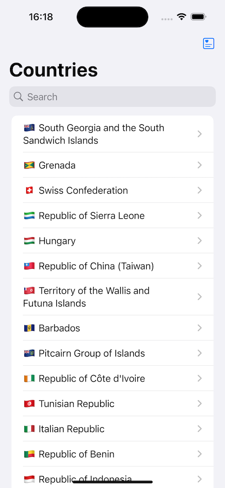
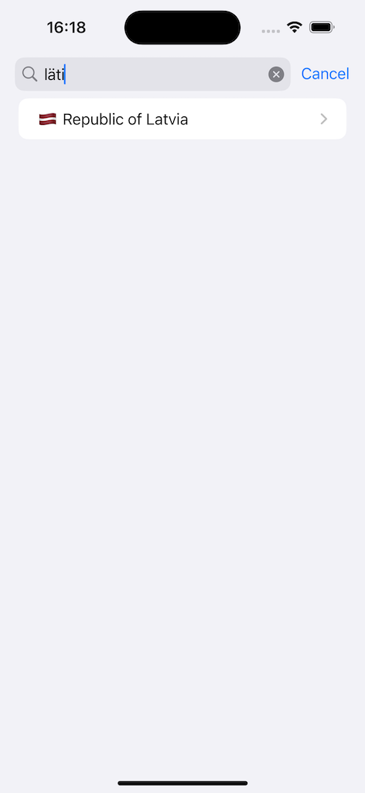
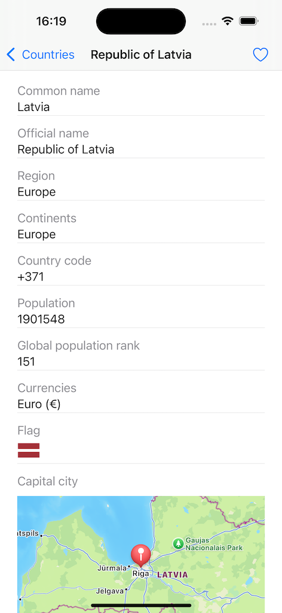
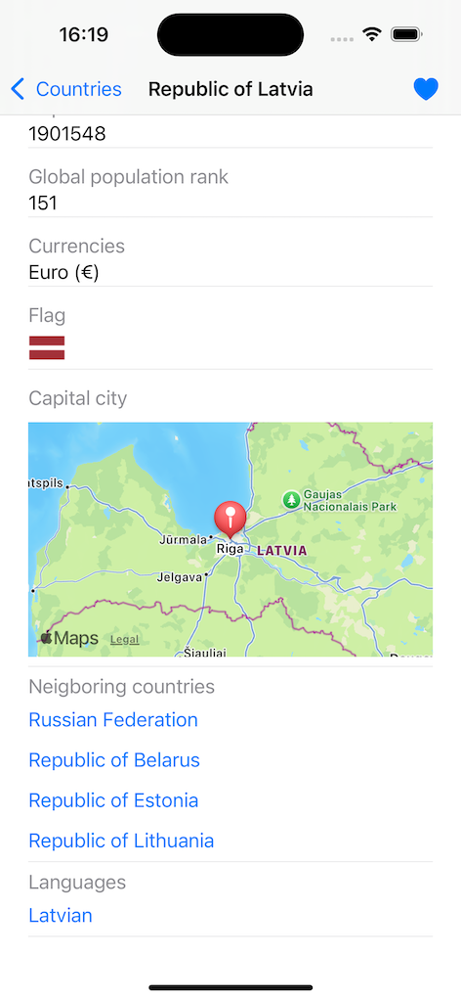
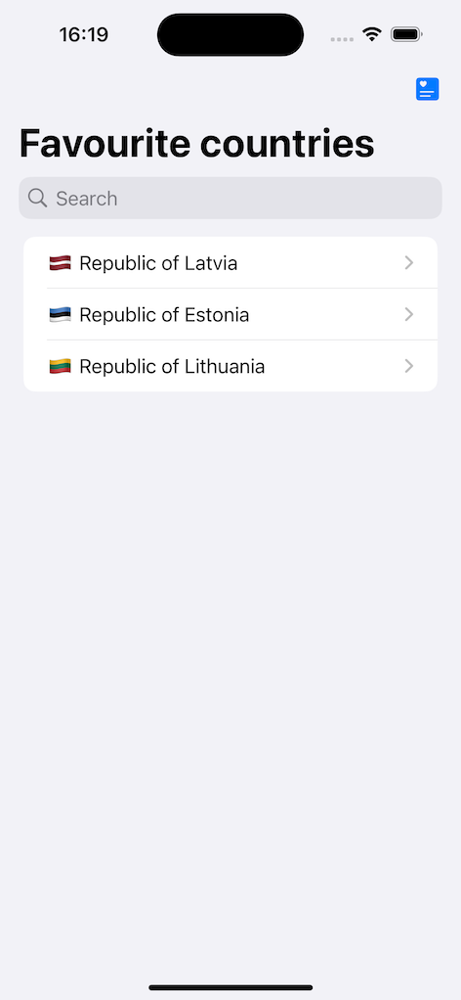
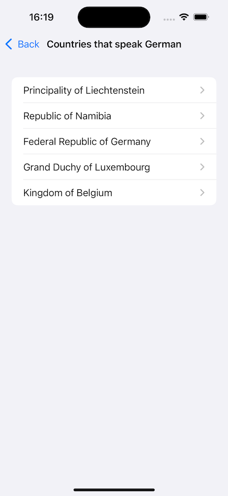

# Country Encyclopedia iOS App

A compact iOS app built with Swift and SwiftUI that provides an encyclopedia of countries with rich search functionality, detailed country information, and interactive features like favorites and map views.

## Table of Contents
- [Features](#features)
- [Requirements](#requirements)
- [API Sources](#api-sources)
- [Installation](#installation)
- [Usage](#usage)
- [Screenshots](#screenshots)
- [Technologies Used](#technologies-used)
- [Project Structure](#project-structure)
- [Testing with XCTest](#testing-with-xctest)

---

## Features
- **Search Functionality:** 
  - Search for countries using multiple parameters such as common name, official name, local names (e.g., Latvia can be found with "Läti" or "Letónia").
- **Country Details:** 
  - Displays the following details for each country:
    - Common name
    - Official name
    - Country code
    - Region
    - Continents
    - Population and global population rank
    - Currencies
    - Flag (Emoji in list view, high-resolution image in detail view)
    - Capital location displayed on an interactive map
    - List of neighboring countries with quick access to their details
    - Languages spoken with the ability to find other countries sharing the same language
- **Favorites:** 
  - Mark and unmark countries as favorites for quick access.
- **Up-to-date Data:** 
  - Fetches data dynamically from [REST Countries API](https://restcountries.com/v3.1/all) and flag images from [Flags API](https://flagsapi.com/).

---

## Requirements
- Xcode 15.0+
- iOS 18.0+ (supports only the newest major iOS version)
- Swift 5.9+
- SwiftUI framework

---

## API Sources
- **Country Data API:** [REST Countries API](https://restcountries.com/v3.1/all)
- **Flag Images API:** [Flags API](https://flagsapi.com/)

---

## Installation
1. Clone the repository:
   ```bash
   git clone https://github.com/melanijagrunte/CountryEncyclopedia.git
   cd CountryEncyclopedia
   ```
2. Open the project in Xcode:
   ```bash
   open CountryEncyclopedia.xcodeproj
   ```
3. Build and run the project on the simulator or a physical device running iOS 17.0+.

---

## Usage
- **Search:** Use the search bar at the top to find countries using multiple parameters (e.g., names in various languages).
- **Browse Countries:** Scroll through the list of countries.
- **View Details:** Tap on any country to see detailed information, including a map view and neighboring countries.
- **Manage Favorites:** Mark your favorite countries and access them easily from the Favorites section.
- **Explore by Language:** Click on a language to see all countries where it's spoken.

---

## Screenshots

<p align="left">
  
  
  
  
  
  
</p>

---

## Technologies Used
- **Swift 5.9** for efficient and modern iOS development.
- **SwiftUI** for building a responsive and dynamic user interface.
- **MapKit** for displaying interactive maps.
- **async/await** for managing asynchronous API calls.
- **URLSession** for handling network requests natively.
- **UserDefaults** for managing favorite countries persistently.

---

## Project Structure
```
CountryEncyclopedia
│
├── Models
│   ├── Country.swift
│
├── Resources
│   ├── Screenshots
│   ├── Assets.xcassets
│
├── Services
│   ├── Client.swift
│   ├── CountryListProvider.swift
│   ├── Favourites.swift
│
├── Utility
│   ├── UserDefaults+.swift
│
├── ViewModels
│   ├── CountriesByLanguageViewModel.swift
│   ├── CountryDetailViewModel.swift
│   ├── CountryListViewModel.swift
│
├── Views
│   ├── CountriesByLanguageView.swift
│   ├── CountryDetailView.swift
│   ├── CountryListView.swift
│   ├── CountryMapView.swift
│   ├── LanguagesView.swift
│   ├── NeighboringCountriesView.swift
│
└── CountryEncyclopediaApp.swift
```

---

## Testing with XCTest
This project includes unit tests for key functionality using XCTest, Apple's framework for unit testing.

### Test Suite
The test suite ensures that core features work as expected, including:
- **Data Parsing:** Ensures that data from the API is correctly parsed into the app's models.
- **View Models:** Verifies that the view models interact with the data layer properly and update UI components.

### Running Tests
1. Open the project in Xcode.
2. Select the **Test** target from the scheme dropdown in Xcode.
3. Press `Command + U` to run the tests.
4. View the test results in the **Test Navigator**.

Tests are located in the `CountryEncyclopediaTests` target, under the `Tests` directory.

Tests cover critical aspects of the app and help ensure the stability of key features. Unit tests help maintain high code quality and reduce the chances of bugs being introduced.
